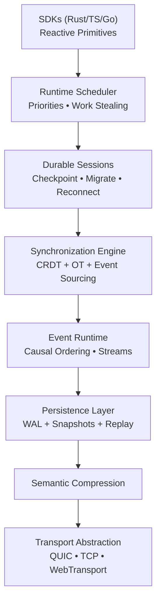

**Project Name: KAIROS**

**Tagline:** *Durable State. Timeless Runtime.*

---

### Why KAIROS?

- **Kairos** (Ancient Greek): The right or opportune moment — representing perfect synchronization, timely state convergence, and the "lived time" of collaborative/agent systems (as opposed to mere chronological time).
- Unique, memorable, sophisticated, and not a common English word.
- Evokes real-time orchestration, durable history, and opportune coordination.
- Brandable: `kairos.dev`, `kairos.rs`, CLI `kairos`, etc.
- Distinct from **SPARK** (the lean, high-performance P2P transport/file delivery system).

---

## KAIROS — Architecture & Runtime Specification

**Status:** Draft v0.1  
**Owner:** Supun Hewagamage  
**Model:** Solo-builder, Rust-first, production-grade distributed systems infrastructure  
**Primary wedge:** A local-first, durable, stateful distributed runtime for realtime collaborative applications, AI agent systems, and persistent edge computing.  
**Last revised:** 2026-05

---

### 1) TL;DR

**KAIROS** is a **distributed stateful runtime platform** that treats synchronized, durable application state as a first-class primitive.

It provides long-lived sessions, automatic state replication, conflict-free merging, event sourcing, deterministic replay, and agent-native coordination — while remaining transport-agnostic and local-first.

Developers work with high-level reactive objects (documents, collections, graphs, memory stores) rather than packets, sockets, or low-level protocols. KAIROS runs efficiently over QUIC (primary), with fallbacks, and works completely offline or in fully self-hosted environments.

**Core promise:** Build multi-user, multi-device, multi-agent applications with the same confidence and simplicity as writing single-process code, but with built-in durability, synchronization, and observability across time and space.

---

### 2) What KAIROS Is

KAIROS is a programmable **distributed runtime** for stateful, synchronized, and persistent applications.

It acts as the "operating system substrate" for:
- Realtime collaborative tools
- Multi-agent AI systems
- Offline-first / edge-native applications
- Persistent session platforms
- Distributed simulations and workflows

**Key Capabilities:**
- **Durable Stateful Sessions** — survive crashes, restarts, network partitions, and device switches.
- **Hybrid State Synchronization** — CRDTs + Operational Transformation + Event Sourcing + Deltas.
- **Replayable Event Runtime** — everything is logged, versioned, and time-travelable.
- **Semantic & Efficient Replication** — schema-aware deltas, structural compression.
- **Agent Primitives** — persistent memory, shared blackboards, inter-agent messaging, orchestration.
- **Runtime Scheduler** — prioritized, fair, congestion-aware execution across nodes.

---

### 3) What KAIROS Is Not

| Not | Reason |
|-----|--------|
| A transport protocol | That is **SPARK** |
| A full database / query engine | Focused on runtime + live synchronization, not OLAP/OLTP |
| A blockchain or Byzantine system | Assumes authenticated participants with different trust model |
| A cloud-only SaaS | Local-first and self-hostable are non-negotiable |
| An application framework | Provides infrastructure primitives only |

---

### 4) Product Thesis

KAIROS wins when developers can ship complex stateful, collaborative, or agent-driven features **orders of magnitude faster** than with WebSockets + custom sync, while achieving better durability, offline support, and performance than existing managed platforms.

**Success criteria:**
- Sub-50ms sync latency on LAN, sub-300ms on WAN for typical operations.
- Sessions survive weeks of disconnection with seamless reconciliation.
- <150 LOC for a production-grade collaborative document or agent swarm.
- Full deterministic replay and time-travel debugging.
- Production usage in collaborative tools and multi-agent systems.

---

### 5) Strategic Positioning

**KAIROS** sits in the sweet spot between:
- Low-level transports (SPARK, QUIC, WebTransport)
- Managed realtime platforms (Liveblocks, Convex, Ably, PartyKit)
- Local CRDT libraries (Yjs, Automerge, ElectricSQL)

It is the **self-hostable, Rust-native, runtime-centric foundation** for the next generation of stateful software.

**Competitive moat:**
- Deep integration of durability, replayability, semantic sync, and agent support.
- Transport abstraction + zero-copy Rust performance.
- First-class support for both human collaboration and AI agents.

---

### 6) Design Principles

1. **State is the Source of Truth** — All runtime behavior derives from durable event logs + snapshots.
2. **Runtime Semantics First** — Hide transports and packets completely from application developers.
3. **Durability & Replayability by Default** — Everything that mutates state is logged.
4. **Local-First & Offline-First** — Full power with zero external services.
5. **Ergonomic & Type-Safe DX** — Reactive, declarative, feels like local state.
6. **Efficiency at Every Layer** — Semantic compression, zero-copy paths, adaptive scheduling.
7. **Observability as a Core Feature** — Time-travel debugging is built-in.
8. **Incremental & Layered** — Build useful artifacts early.

---

### 7) System Stack — Nine Layers

```
┌──────────────────────────────────────────────────────────────┐
│ L1  Experience & SDK Layer          Reactive APIs, Bindings   │
├──────────────────────────────────────────────────────────────┤
│ L2  Distributed Runtime Scheduler   Tasks, Prioritization     │
├──────────────────────────────────────────────────────────────┤
│ L3  Durable Session Engine          Continuity, Migration     │
├──────────────────────────────────────────────────────────────┤
│ L4  State Synchronization Engine    CRDT/OT/Delta Merging     │
├──────────────────────────────────────────────────────────────┤
│ L5  Event Runtime & Pub/Sub         Ordering, Replay, Streams │
├──────────────────────────────────────────────────────────────┤
│ L6  Persistence & History Engine    WAL, Snapshots, GC        │
├──────────────────────────────────────────────────────────────┤
│ L7  Semantic Compression Layer      Deltas, Schema, Graphs    │
├──────────────────────────────────────────────────────────────┤
│ L8  Transport Abstraction Layer     QUIC primary, fallbacks   │
├──────────────────────────────────────────────────────────────┤
│ L9  Platform & Observability        Testing, Replay, Metrics  │
└──────────────────────────────────────────────────────────────┘
```

---

### 8) Architecture Overview



---

### 9) Durable Stateful Sessions (Core)

Sessions in KAIROS are **first-class runtime citizens**:

- Bound to long-term identities (Ed25519)
- Automatic reconnection + incremental reconciliation
- Checkpointing + session snapshots
- Migration between nodes (edge ↔ cloud ↔ edge)
- Multi-device continuity for the same logical user
- Offline buffering with later merge
- Graceful degradation and conflict resolution policies

---

### 10) State Synchronization Engine

**Hybrid strategy** (chosen per replication group or object type):

- **CRDTs** — Default for convergent data (rich types: Text, Map, Array, Graph, Counter, etc.)
- **Operational Transformation** — High-frequency linear editing
- **Event Sourcing + Deltas** — Domain logic and audit-heavy flows
- **Version Vectors + Hybrid Clocks** — Causal consistency
- **Deterministic merge functions** with pluggable conflict resolvers

**Replication topologies:** Full-mesh (small), hierarchical, gossip-assisted.

---

### 11) Event Runtime

- Append-only event logs as ground truth
- Causal broadcast with strong ordering guarantees
- Partial subscriptions and projections
- Durable channels and shared memory regions
- Built-in support for streaming large payloads (tokens, media, etc.)

---

### 12) Persistence & Replay Engine

- Write-ahead log (WAL) for all mutations
- Periodic immutable snapshots (binary efficient format)
- Deterministic full or partial replay
- Time-travel debugging and "what-if" simulation
- Configurable retention and garbage collection
- Crash recovery and incremental restore

---

### 13) Agent Runtime Subsystem

First-class support for AI agents:

- Persistent contextual memory (structured + vector)
- Shared blackboards and memory graphs
- Inter-agent event streams and coordination primitives
- Streaming response synchronization
- Agent supervision, handoff, and orchestration patterns
- Checkpoint/restore for long-running agents

---

### 14) Semantic Compression & Efficiency

- Schema-driven delta encoding
- Structural diffing for documents and graphs
- Adaptive compression pipelines
- Bloom filters / sketches for sync metadata
- Bandwidth-aware and energy-aware modes

---

### 15) Transport Abstraction

- **Primary:** QUIC (via `quinn` or similar) — 0-RTT, multiplexing, excellent congestion control
- **Fallbacks:** WebTransport, TCP/WebSocket, raw channels
- SPARK can be used as a specialized local P2P transport backend when beneficial
- Transport details are completely hidden from higher layers

---

### 16) SDK & Developer Experience

**Core SDKs:**
- **Rust** — Maximum performance and control
- **TypeScript** — Web, Node.js, Edge, browser
- **Go** — Servers and heavy agents

**Example API feel (Rust):**
```rust
let room = kairos.join("workspace:docs-42").await?;
let doc = room.document("spec.md").await?;

doc.text("content")
   .insert(100, "New section")
   .await?;

let sub = doc.subscribe(|delta| { ... }).await;
```

- Optimistic updates + automatic rollback on conflict
- Reactive queries
- Automatic reconnection and presence
- Schema generation and type safety

---

### 17) Security & Identity Model

- End-to-end encryption of all state and events
- Capability-based authorization (fine-grained on objects/streams)
- Forward secrecy and session key rotation
- Runtime isolation between tenants
- Identity-bound sessions with multi-device support

---

### 18) Observability & Debugging

- Rich structured tracing
- Prometheus-compatible metrics
- Event capture and deterministic replay tools
- Visual timeline debugger
- "Replay-as-a-service" for production incidents

---

### 19) Architectural Comparisons

*(Similar table as before, but focused on runtime aspects — omitted here for brevity)*

KAIROS excels in durability, replayability, agent support, and self-hostability compared to managed platforms, while offering far higher-level abstractions than raw transports or libraries.

---

### 20) Implementation Strategy & Repository

**Repository:** `kairos`

**Key Crates:**
- `kairos-runtime` — Core scheduler and session engine
- `kairos-sync` — Synchronization primitives and CRDTs
- `kairos-persist` — WAL, snapshots, replay
- `kairos-sdk-*` — Language-specific bindings
- `kairos-cli` — Management and debugging tools
- `kairos-relay` — Optional self-hostable relay/rendezvous

**Phased rollout** starting with Rust SDK + QUIC + basic CRDT document sync.

